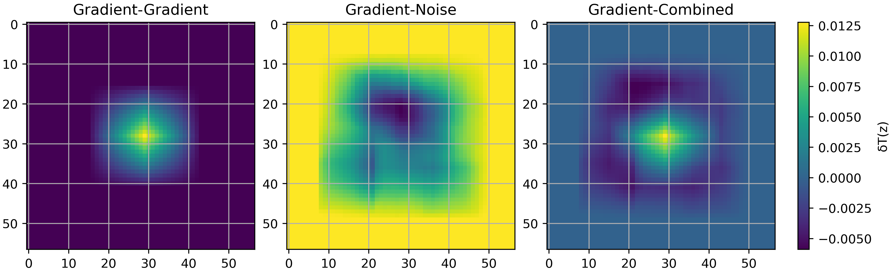
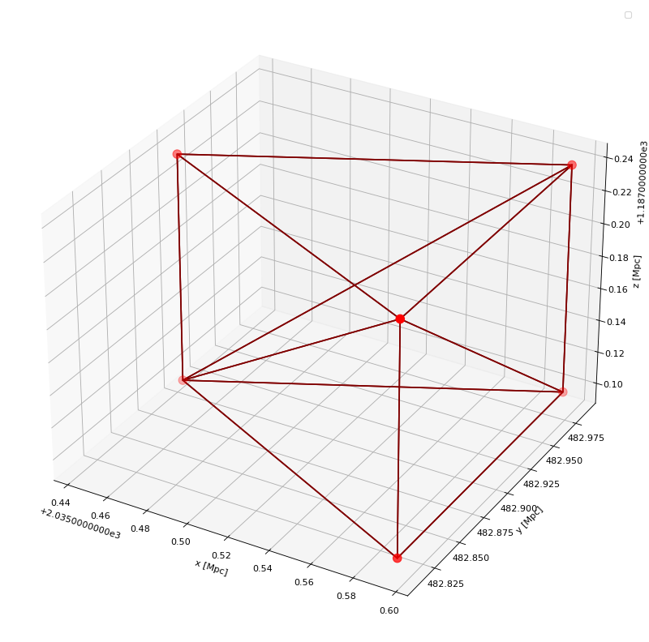
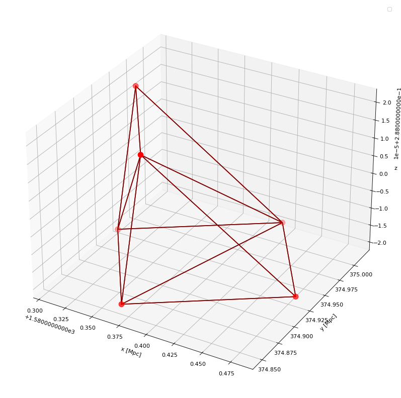
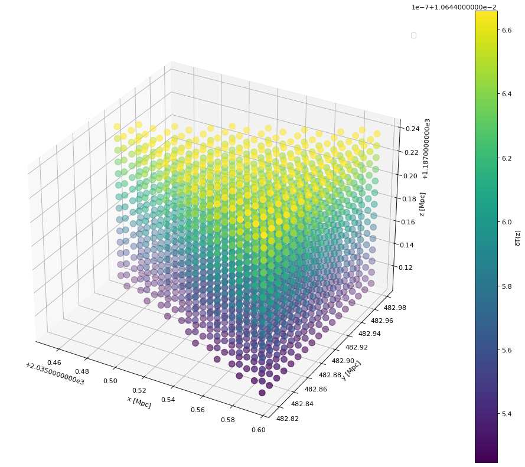
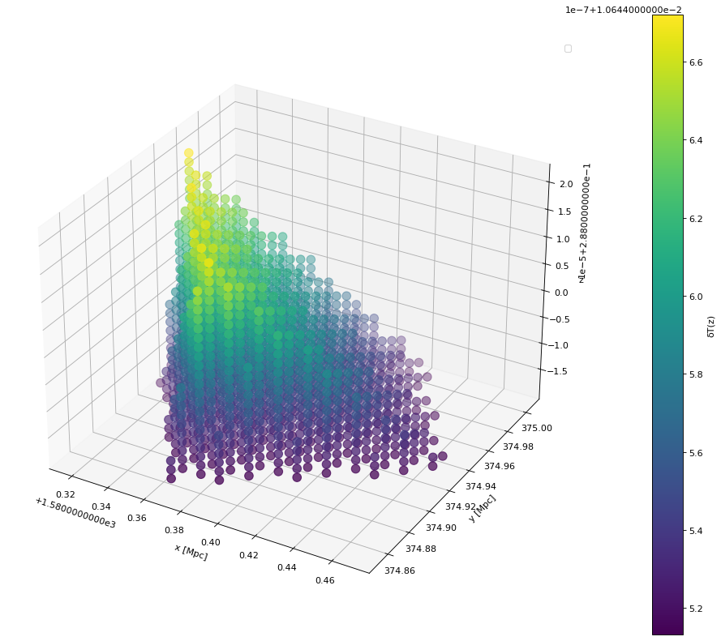
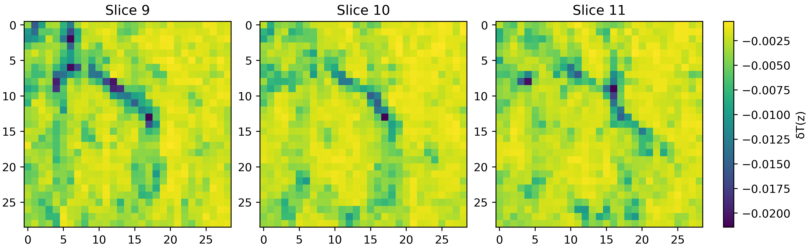
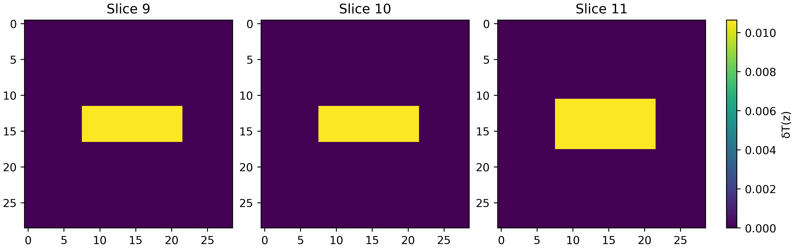
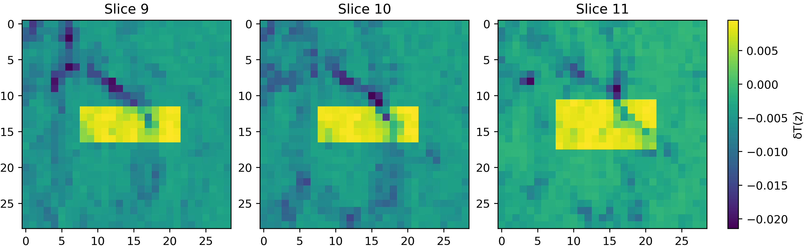
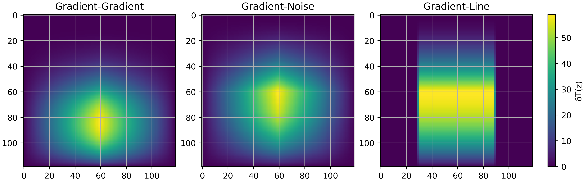
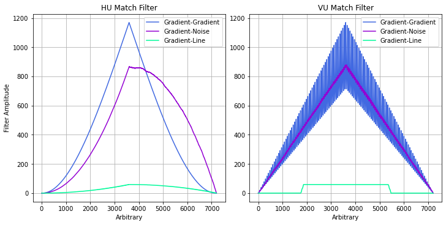

<p align="center">
  
</p>

<h1 align="center">Cosmic String Signals</h1>

<p align="center">
  Synthetic 3D signal detection and matched-filter extraction in noisy fields.<br>
  Volumetric wake generation, SO(3) coordinate transforms, brightness temperature modeling, and correlation-based signal scoring.
</p>

<p align="center">
  <a href="https://github.com/IsolatedSingularity/Cosmic-String-Signals/actions/workflows/ci.yml"></a>
  <a href="https://www.python.org/"></a>
  <a href="LICENSE"></a>
  <a href="#quick-start"></a>
</p>

<p align="center">
  <a href="#overview">Overview</a> |
  <a href="#quick-start">Quick Start</a> |
  <a href="#pipeline">Pipeline</a> |
  <a href="#architecture">Architecture</a> |
  <a href="#theory">Theory</a> |
  <a href="#references">References</a> |
  <a href="#citation">Citation</a>
</p>

---

## Overview

This project implements a synthetic data generation and analysis pipeline for studying weak, structured signals embedded in high-dimensional noise fields. The system generates 3D scalar fields, embeds planar geometric features (modeled as cosmic string wakes), and evaluates detectability using statistical filtering methods against stochastic noise backgrounds.

### Why This Pipeline?

Detecting faint topological signals buried in cosmological noise is a core challenge in observational cosmology and signal processing. The wake left by a cosmic string produces a temperature anisotropy in 21cm radiation that is orders of magnitude weaker than the surrounding primordial perturbations. Standard point-source detection fails here because the signal is spatially extended, geometrically structured, and non-Gaussian. This pipeline addresses the problem by combining volumetric field construction with matched-filter correlation, a technique proven in gravitational wave detection (LIGO) and adapted here for 3D cosmological data cubes.

---

## Quick Start

```bash
git clone https://github.com/IsolatedSingularity/Cosmic-String-Signals.git
cd Cosmic-String-Signals
pip install -e .
```

Run the full simulation pipeline:

```bash
python "Cosmic String Extraction Statistics.py"
```

Run the test suite:

```bash
pip install -e ".[dev]"
python -m pytest tests/ -v
```

---

## Pipeline

The simulation executes a five-stage pipeline, from universe initialization through statistical signal extraction.

### 1. Universe Initialization

Sets the Hubble volume, cosmological parameters ($H_0$, $\Omega_m$), and random seeds for reproducibility. Constructs the 3D lattice representing the observable volume.

### 2. Wake Geometry Construction

Builds a finite-length cosmic string segment and computes its wake wedge geometry as a 6-vertex convex structure in $\mathbb{R}^3$. The wake is parameterized by the string tension $G\mu$, deficit angle, string speed, and formation redshift. Arbitrary spatial orientations are applied via $SO(3)$ rotation matrices acting on the shifted vertex set.

|  |  |
|:--:|:--:|
|  |  |
| Wake wedge geometry in physical coordinates (Mpc) | Same wake mapped to redshift space via $d(z)$ |

### 3. Temperature Field Assignment

Points inside the wake's convex hull receive a brightness temperature gradient $\delta T_b(z)$ derived from the 21cm emission model. Points outside the hull remain at ambient temperature. The convex hull membership test uses a vertex-stability method: if adding a test point does not alter the hull vertices, the point is interior.

|  |  |
|:--:|:--:|
|  |  |
| Brightness temperature gradient within the wake | Temperature field mapped to redshift coordinates |

### 4. Noise Embedding

Superimposes the wake signal onto a 3D $\Lambda\text{CDM}$ cosmological noise map (generated via 21cmFAST simulations). The combined data cube contains both the structured wake signal and the stochastic primordial perturbations, producing a realistic detection scenario.

|  |  |  |
|:--:|:--:|:--:|
|  |  |  |
| $\Lambda\text{CDM}$ noise slices | Wake temperature slices | Combined signal + noise |

### 5. Matched Filtering and Signal Extraction

Applies matched filtering by correlating the wake template with the observed data. The pipeline evaluates both 1D (unfolded array correlation via `np.correlate`) and 2D (convolution via `scipy.signal.convolve2d`) approaches across multiple slicing orientations to maximize the signal-to-noise ratio.

|  |  |
|:--:|:--:|
|  |  |
| 2D convolution: wake-wake vs. wake-noise vs. wake-combined | 1D matched filter output across unfolding orientations |

---

## Architecture

```
cosmic_string_signals/
    __init__.py              # Package root, version
    geometry.py              # SO(3) rotations, wake wedge construction, hull checks
    temperature.py           # Brightness temperature models (CMB, kinetic, gas)
    filtering.py             # Matched filtering (1D correlation, 2D convolution, unfolding)
Cosmic String Extraction Statistics.py   # Full simulation pipeline script
tests/
    test_imports.py          # Import smoke tests
    test_geometry.py         # Rotation matrices, wedge construction, hull membership
    test_temperature.py      # Temperature model sanity checks
    test_filtering.py        # Unfolding and correlation tests
Plots/                       # Generated figures
Cited Literature/            # Reference papers
```

### Tech Stack

| Technology | Role |
|------------|------|
| Python 3.10+ | Core language |
| NumPy | Vectorized grid computation, array manipulation, correlation |
| SciPy | Convex hull geometry, 2D signal convolution |
| Astropy | Cosmological distance-redshift conversions (Planck18) |
| Matplotlib | 3D scatter plots, 2D heatmaps, filter output visualization |
| pytest | Test suite (20 tests) |
| GitHub Actions | CI across Python 3.10, 3.11, 3.12 |

---

## Theory

<details>
<summary><strong>Cosmic String Wakes and Signal Detection</strong> (click to expand)</summary>

### Topological Defects

In the early universe, symmetry-breaking phase transitions can produce topologically stable defects. When a scalar field $\phi$ with potential

$$V(\phi) = \frac{1}{4}g(|\phi|^2 - \eta^2)^2$$

undergoes spontaneous symmetry breaking, the vacuum manifold $M$ may become topologically non-trivial. If $M \simeq S^1$, the first homotopy group $\pi_1(M)$ is non-trivial, ensuring the existence of stable line defects: cosmic strings.

### String Tension and Wake Formation

The energy scale of symmetry breaking sets the string tension:

$$G\mu \sim \left(\frac{\eta}{M_{\text{Pl}}}\right)^2$$

As strings move at relativistic speeds, they generate planar overdensities (wakes) in the surrounding matter distribution. These wakes induce temperature anisotropies in 21cm radiation.

### Brightness Temperature

The differential brightness temperature at redshift $z$ is modeled as:

$$\delta T_b(\nu) = [0.07 \, \text{K}] \, \frac{x_c}{1+x_c} \left(1 - \frac{T_{\gamma}(z)}{T_{K/g}(z)}\right) \sqrt{1+z}$$

where $x_c$ is the collision coupling coefficient, $T_{\gamma}(z)$ is the CMB photon temperature, and $T_{K/g}(z)$ characterizes the kinetic/gas temperature within the wake.

### Matched Filtering

The signal extraction uses matched filtering, a technique widely applied in gravitational wave detection. By correlating an assumed template (wake profile) with the observed data, the method amplifies the structured signal relative to stochastic noise. Both 1D cross-correlation and 2D convolution are applied across multiple spatial orientations to identify the optimal detection axis.

### Distance-Redshift Mapping

Physical coordinates are converted to redshift space via the cosmological distance-redshift relation for a flat FRW universe:

$$d(z) = \int_0^z \frac{c \, dz'}{H(z')}$$

This mapping (computed numerically via `astropy.cosmology`) allows the wake geometry to be represented in the coordinate system most directly comparable to observations.

</details>

---

## References

1. Brandenberger, R. et al. - "The 21 cm Signature of Cosmic String Wakes"
2. Maibach et al. - "Extracting the Signal of Cosmic String Wakes from 21-cm Observations"
3. Brandenberger, R. - "Searching for Cosmic Strings in New Observational Windows"
4. Ting et al. - "Non-Gaussianity of the 21 cm Signal"

## Citation

```bibtex
@software{morais2022cosmicstrings,
    title  = {Cosmic String Signals: Synthetic 3D Signal Detection Pipeline},
    author = {Morais, Jeffrey},
    year   = {2022},
    url    = {https://github.com/IsolatedSingularity/Cosmic-String-Signals}
}
```

---

## See Also

| Project | Description |
|---------|-------------|
| [TQNN](https://github.com/IsolatedSingularity/Topological-Quantum-Neural-Networks) | Topological Quantum Neural Networks: interactive visualization toolkit |
| [Quantum Trajectories](https://github.com/IsolatedSingularity/Quantum-Trajectories) | Numerical PDE solver for trajectory fields |
| [QLDPC](https://github.com/btq-ag/QLDPC) | Quantum LDPC error correction toolkit |
| [QRiNG](https://github.com/btq-ag/QRiNG) | Quantum random number generation framework |

---

## Contact

**Jeffrey Morais** - [Website](https://ichor.pages.dev/) | [GitHub](https://github.com/IsolatedSingularity) | [LinkedIn](https://www.linkedin.com/in/jeffrey-morais)

Questions or ideas are welcome. [Open an issue](https://github.com/IsolatedSingularity/Cosmic-String-Signals/issues) or reach out directly.

---

## License

[MIT](LICENSE)
